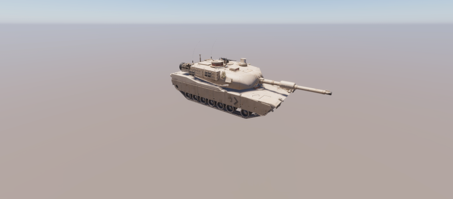
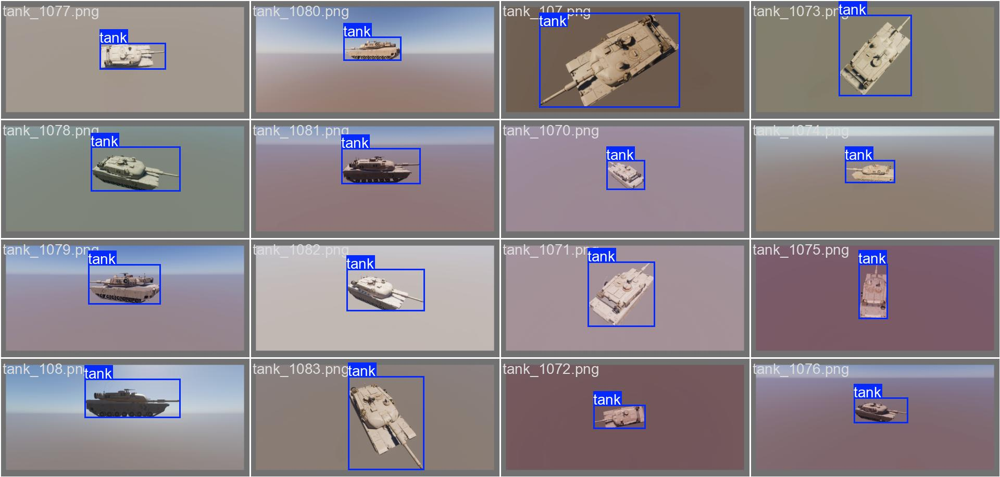

# AI-Target-Detection-via-Unity-Simulation

Bu proje, bilgisayarlı görü (computer vision) ve nesne tespiti (object detection) modellerini eğitmek amacıyla Unity oyun motoru kullanılarak otomatik sentetik veri ve etiket (bounding box) üretimini sağlayan bir simülasyon altyapısıdır.

## Projenin Amacı

Savunma sanayii ve taktiksel saha uygulamalarında, makine öğrenmesi modellerini eğitmek için farklı açılardan, çeşitli ışık koşullarında ve zengin arka planlarda çekilmiş yeterli miktarda gerçek askeri araç (tank, zırhlı araç vb.) verisine ulaşmak zor ve maliyetlidir. Bu projenin temel amacı, veri kıtlığı (data scarcity) problemini çözmek için Unity Perception paketini kullanarak %100 sentetik, otomatik etiketlenmiş ve domain adaptasyonuna uygun devasa veri setleri üretmektir.
Aşağıdaki görsel, Unity Perception kamerası tarafından rastgele aydınlatma ve açı parametreleriyle üretilmiş ham bir sentetik veriyi (step0.camera.png) temsil etmektedir:

## Otomatik Etiketleme

Üretilen sentetik veriler, YOLO formatına dönüştürüldükten sonra modelin eğitim ve doğrulama (validation) aşamalarında kullanılır. Aşağıdaki görsel, sistemin hedefleri (bounding box) otomatik olarak ne kadar yüksek bir hassasiyetle çizdiğini ve YOLO formatına aktardığını göstermektedir:

*(Otonom olarak etiketlenmiş ve YOLO veri setine dönüştürülmüş sentetik eğitim verilerinden bir kesit)*
## Mevcut Durum ve Gelecek Hedefleri

Proje şu anda aktif geliştirme aşamasındadır . v1.0 sürümü ile temel sentetik veri üretimi ve YOLOv8 entegrasyonu başarıyla tamamlanmıştır.
Planlanan geliştirmeler:
* Dinamik hava koşulları (sis, yağmur) ve termal kamera simülasyonu adaptasyonları.
* Veri setinin Train/Validation/Test alt kümelerine otonom olarak ayrılması.

## Sentetik Veri Üretim Metodolojisi

Sistem, "Domain Randomization" (Alan Rastgeleleştirme) prensibiyle çalışır. 
1. Unity sahnesinde bulunan Perception Camera, belirlenen parametreler dahilinde her karede (frame) rastgele bir konuma ve açıya geçer.
2. Işıklandırma (Directional Light) her karede rastgele yoğunluk ve açılarda değişerek günün farklı saatlerini simüle eder.
3. Arka plan materyalleri sürekli değiştirilerek modelin arka planı ezberlemesi (overfitting) engellenir.
4. Üretilen görseller ve bu görsellerdeki hedefin (tank) bounding box koordinatları Unity tarafından SOLO JSON formatında dışa aktarılır.
5. "ai" klasörü içerisindeki Python scripti (converter.py), bu JSON dosyalarını işleyerek matematiksel dönüşümlerle YOLO (.txt) formatına uygun hale getirir.

## Nasıl Çalıştırılır? (Kurulum ve Kullanım)

Git repository boyutunu (Git LFS limitlerini) optimize etmek ve best-practice standartlarını korumak amacıyla, devasa boyuttaki 3D askeri araç modelleri ve kaplamaları (textures) bu repoya dahil edilmemiştir. Proje, "Tak-Çalıştır"  mantığıyla kendi 3D modellerinizi entegre edebileceğiniz bir iskelet yapıda sunulmaktadır.

Kendi veri setinizi üretmek için aşağıdaki adımları izleyiniz:

### 1. Unity Simülasyonunun Hazırlanması
1. Bu repository'i bilgisayarınıza klonlayın: `git clone <repo-url>`
2. Unity Hub uygulamasını açın, "Add project from disk" seçeneği ile klonladığınız ana klasörü seçerek projeyi başlatın (Unity sürümü ve Perception paketi bağımlılıkları Packages klasöründen otomatik okunacaktır).
3. İnternet üzerinden (Sketchfab, Unity Asset Store vb.) telifsiz bir 3D taktiksel araç (Tank, İHA vb.) modeli indirin (FBX veya OBJ formatında).
4. İndirdiğiniz modeli Unity içerisinde `Assets` klasörüne sürükleyip bırakarak projeye dahil edin.

### 2. Sahne, Kamera ve Model Etiketleme Ayarları
Sistemin hedefleri tanıyabilmesi ve rastgeleleştirme motorunun çalışabilmesi için sahnedeki objelerin birbirine bağlanması gerekmektedir:
1. Kameranın Hazırlanması: `Assets` klasörü altındaki `OutdoorsScene` isimli sahneyi açın. Hierarchy penceresinden `Main Camera` objesine tıklayın. Inspector panelinden "Add Component" diyerek `Perception Camera` eklentisini kameraya dahil edin.
2. Modelin Sahneye Alınması: İçe aktardığınız 3D askeri araç modelini sahnenin merkezine (Hierarchy penceresine) sürükleyin.
3. Randomizer Scriptlerinin Eklenmesi: Hierarchy'deki 3D modelinize tıklayın ve Inspector panelinden "Add Component" diyerek aşağıdaki scriptleri modele ekleyin:
   * `CameraRandomizerTag`: Simülasyon sırasında kameranın bu objeyi referans alarak etrafında rastgele açılarda gezinmesini sağlar.
   * `SunLightRandomizerTag`: Objeyi ışık döngüsüne dahil eder.
4. Hedefin İsimlendirilmesi (Labeling): Modele tekrar "Add Component" diyerek Unity Perception paketinin temel taşı olan `Labeling` componentini ekleyin. Eklenen bu componentin içindeki listeye tıklayıp hedefinize bir etiket ismi girin (Örneğin: `tank`).
5. Konfigürasyonun Eşleştirilmesi: `Assets` klasörü içerisinde bulunan `IdLabelConfig` isimli konfigürasyon dosyasına tıklayın. Inspector panelinde açılan listeye, bir önceki adımda modele verdiğiniz etiket ismini (Örn: `tank`) tam olarak aynı şekilde ekleyin. Bu işlem, yapay zekanın görseldeki objenin ne olduğunu bilmesini sağlar.
6. Simülasyonu Başlatma: Tüm etiketlemeler tamamlandıktan sonra Unity editöründe "Play" tuşuna basın. Sistem otomatik olarak kamerayı hareket ettirecek, ışığı değiştirecek ve saniyede onlarca farklı varyasyonda etiketlenmiş fotoğraf çekip JSON formatında dışa aktarmaya başlayacaktır.

### 3. Yapay Zeka Modelinin Test Edilmesi
Proje içerisinde halihazırda eğitilmiş bir yapay zeka modeli ağırlığı (weights) bulunmaktadır. Modeli hemen test etmek için:
1. Terminal üzerinden `ai` klasörüne gidin.
2. Gerekli kütüphaneleri kurun: `pip install ultralytics`
3. Test etmek istediğiniz herhangi bir gerçek tank fotoğrafını bu klasöre atın (örneğin adını `test_goruntusu.jpg` yapın).
4. Klasör içerisindeki `test.py` dosyasını çalıştırarak modelin çıkarım başarısını `runs/detect/predict` dizini altında inceleyebilirsiniz.

## Lisans ve Krediler
* Kaynak Kodlar: Bu repodaki tüm Python ve C# (Unity) kaynak kodları açık kaynaklı olup MIT Lisansı altındadır. İstediğiniz gibi kullanabilir ve geliştirebilirsiniz.
* 3D Assetler: Proje mimarisini test etmek için kullanılan 3D modeller repoya dahil edilmemiştir, son kullanıcı kendi lisanslı veya telifsiz assetlerini projeye entegre etmekle sorumludur.
